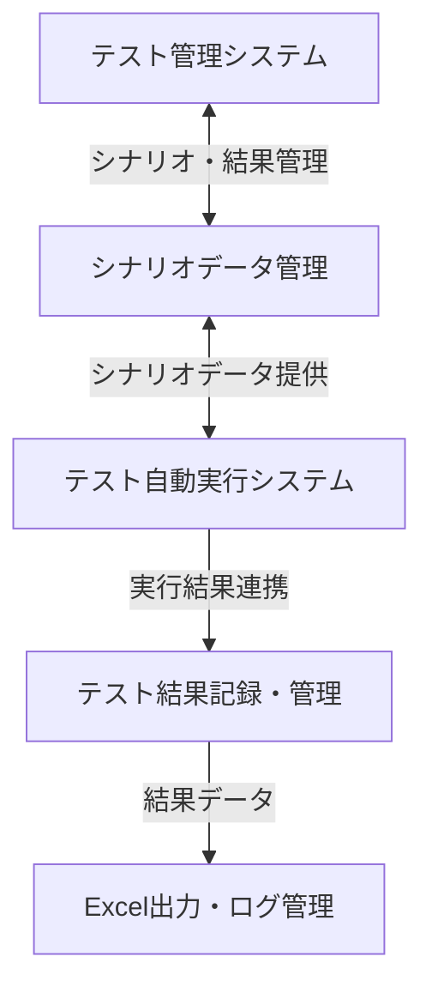

# High-Level-Design（改訂版）

## 1. アーキテクチャ概要



- テスト管理システム：GUIでシナリオ・テスト結果を管理、手動実行もサポート
- テスト自動実行システム：Selenium等で自動実行、結果を管理システムへ連携
- テスト結果は一元管理し、Excel出力・ログ管理が可能
- スクリーンショット取得は将来要件

## 2. フォルダ構成（プロトタイプ）

```bash
project-root/
│
├── main.py # アプリ起動エントリ
├── gui/ # GUIアプリ関連
│ ├── main_window.py
│ └── scenario_runner.py
├── core/ # ロジック層
│ ├── scenario_loader.py
│ ├── test_executor.py
│ └── screenshot.py
├── templates/ # 雛形出力用テンプレート
│ └── test_template.py.j2
├── static/ # UI用アイコン等
├── data/ # 読み込んだExcelやログの保存先
├── tests/ # ユニットテスト等
└── requirements.txt # 依存パッケージ一覧
```

## 3. コンポーネント設計（抜粋）

### `scenario_loader.py`
- Excelファイルを読み込み、シナリオ単位で分割
- pandas + openpyxlで対応

### `test_executor.py`
- seleniumなどでブラウザ操作
- テスト実行結果を記録し、管理システムへ連携
- （将来）スクリーンショット取得

### `main_window.py`
- GUI上でシナリオ選択・実行・結果記録・Excel出力を操作

### `screenshot.py`
- （将来）ブラウザの状態を定期的にキャプチャし、保存パスを返す