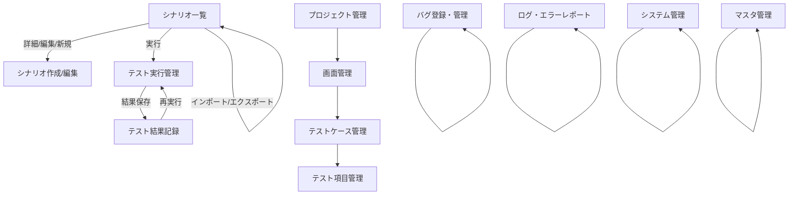

# GUI設計（ドラフト）

## 0. 画面一覧表

| 画面ID   | 画面名             | 主な機能・役割                  | 備考                |
|----------|--------------------|---------------------------------|---------------------|
| TAT001   | シナリオ一覧       | シナリオの一覧・検索・操作      |                     |
| TAT002   | シナリオ作成/編集  | シナリオの新規作成・編集        |                     |
| TAT003   | テスト実行管理     | テストの実行・進捗・記録        | 手動/自動切替あり   |
| TAT004   | テスト結果記録     | 実行履歴・詳細・エクスポート     |                     |
| TAT005   | プロジェクト管理   | プロジェクトの新規・編集・削除   |                     |
| TAT006   | 画面管理           | 画面（スクリーン）情報の管理     | 画像登録・ID自動付与|
| TAT007   | テストケース管理   | テストケースの管理               |                     |
| TAT008   | テスト項目管理     | テスト項目の管理                 |                     |
| TAT009   | バグ登録・管理     | バグ情報の登録・編集・一覧       | BUG-ID自動付与      |
| TAT010   | ログ・エラーレポート| ログの閲覧・出力・クリア         |                     |
| TAT011   | システム管理       | ユーザー・権限・設定             |                     |
| TAT012   | マスタ管理         | マスタデータの管理・編集          | マスタ種別切替対応   |

## 1. 画面構成（トップレベル）

- サイドバー（カテゴリ選択）
    - シナリオ管理
    - テスト管理
    - 不具合管理
    - 運用管理
    - システム管理
    - マスタ管理

- メインビュー（カテゴリごとにサブカテゴリ切替）
    - シナリオ管理：[一覧][作成][編集][詳細][インポート][エクスポート]
    - テスト管理：[一覧][実行][結果記録][エクスポート]
    - 不具合管理：[一覧][登録][編集][詳細][エクスポート]
    - 運用管理：[プロジェクト管理][画面管理][テストケース管理][テスト項目管理][マスタ管理]
    - システム管理：[ユーザー管理][権限管理][ログ管理][設定]
    - マスタ管理：[一覧][新規作成][編集][削除][インポート][エクスポート]

---

## 2. 機能設計

### TAT001. シナリオ一覧

#### 目的
- 登録済みのテストシナリオを一覧表示し、検索・詳細確認・編集・実行などの操作を行う。

#### 主な機能
- シナリオの一覧表示（テーブル形式、縦スクロールで全件表示。大量データ時は仮想スクロール対応）
- キーワード検索
- 新規作成・インポート・エクスポート
- 詳細・編集・実行ボタン

#### 入出力項目
- 入力：検索キーワード、操作ボタン（詳細・編集・実行等）
- 出力：シナリオ一覧（No, シナリオ名, ステータス, 最終実行日, 実行結果, 操作）

#### 遷移先
- 詳細ボタン → シナリオ詳細画面（TAT002）
- 編集ボタン → シナリオ編集画面（TAT002）
- 実行ボタン → テスト実行管理画面（TAT003）
- 新規作成 → シナリオ作成画面（TAT002）
- インポート/エクスポート → ファイルダイアログ

#### 備考
- プロジェクト選択により表示内容が切り替わる
- ステータスや実行結果は色分け表示
- 縦スクロールで全件表示（大量データ時は仮想スクロール等でパフォーマンス配慮）

### TAT002. シナリオ作成/編集

#### 目的
- テストシナリオの新規作成や既存シナリオの編集を行う。

#### 主な機能
- シナリオ名・説明の入力・編集
- ステップ一覧表示・追加・編集・削除
- ステップ編集ダイアログ
- 編集・保存・キャンセル・戻るボタン

#### 入出力項目
- 入力：シナリオ名、説明、ステップ内容、操作ボタン
- 出力：シナリオ詳細情報、ステップ一覧

#### 遷移先
- 保存・キャンセル・戻る → シナリオ一覧画面（TAT001）

#### 備考
- 新規作成時は最初から編集可能
- 詳細表示時は「編集」ボタンで編集モードに切替
- 編集モード時のみ「保存」「キャンセル」ボタンが有効

### TAT003. テスト実行管理

#### 目的
- シナリオごとにテストを手動または自動で実行し、結果を記録する。

#### 主な機能
- シナリオ選択リスト
- 実行方式選択（手動/自動）
- テストステップ表示・実行
- 実行ログ表示
- 結果保存・Excel出力ボタン

#### 入出力項目
- 入力：シナリオ選択、実行方式、各ステップの成否・備考、操作ボタン
- 出力：実行ログ、実行結果、コメント

#### 遷移先
- 結果保存・Excel出力 → テスト結果記録画面（TAT004）

#### 備考
- 手動/自動の切替UIを明示
- 失敗時は自動で不具合登録

### TAT004. テスト結果記録

#### 目的
- テスト実行履歴や詳細結果を記録・管理・エクスポートする。

#### 主な機能
- シナリオ選択・詳細表示
- 実行履歴一覧・詳細表示
- Excel出力・ログ出力・再実行ボタン

#### 入出力項目
- 入力：シナリオ選択、操作ボタン
- 出力：実行履歴一覧、詳細情報

#### 遷移先
- Excel出力・ログ出力 → ファイルダイアログ
- 再実行 → テスト実行管理画面（TAT003）

#### 備考
- ステップごとの成否・サムネイル表示

### TAT005. プロジェクト管理

#### 目的
- プロジェクトの新規作成・編集・削除・一覧管理を行う。

#### 主な機能
- プロジェクト一覧表示・新規作成・編集・削除
- プロジェクト詳細・編集ダイアログ（タブ形式）
- エクスポート・インポートボタン

#### 入出力項目
- 入力：プロジェクト名、説明、状態、操作ボタン
- 出力：プロジェクト一覧、詳細情報

#### 遷移先
- 詳細・編集 → プロジェクト詳細ダイアログ

#### 備考
- タブ切替でシナリオ・画面一覧も表示

### TAT006. 画面管理

#### 目的
- プロジェクトごとに画面（スクリーン）情報を管理する。

#### 主な機能
- 画面一覧表示・新規作成・編集・削除・インポート
- 画面詳細・編集ダイアログ
- 画像登録・サムネイル表示

#### 入出力項目
- 入力：画面名、種別、備考、画像、操作ボタン
- 出力：画面一覧、詳細情報、画像サムネイル

#### 遷移先
- 詳細・編集 → 画面詳細ダイアログ

#### 備考
- 画面IDは自動生成（プレフィックス/サフィックス/通し番号）
- 画像は複数登録・拡大可能

### TAT007. テストケース管理

#### 目的
- 画面ごとにテストケースを管理する。

#### 主な機能
- テストケース一覧表示・新規作成・編集・削除・インポート・エクスポート
- テストケース詳細・編集ダイアログ

#### 入出力項目
- 入力：テストケース名、種別、状態、備考、操作ボタン
- 出力：テストケース一覧、詳細情報

#### 遷移先
- 詳細・編集 → テストケース詳細ダイアログ

#### 備考
- テストケースIDは自動生成
- 画面選択でリスト切替

### TAT008. テスト項目管理

#### 目的
- テストケースごとにテスト項目を管理する。

#### 主な機能
- テスト項目一覧表示・新規作成・編集・削除・インポート・エクスポート
- テスト項目詳細・編集ダイアログ

#### 入出力項目
- 入力：テスト項目名、入力データ、操作手順、期待結果、優先度、担当者、実施日、結果、不具合ID、備考、操作ボタン
- 出力：テスト項目一覧、詳細情報

#### 遷移先
- 詳細・編集 → テスト項目詳細ダイアログ

#### 備考
- テスト項目IDは自動生成
- テストケース選択でリスト切替

### TAT009. バグ登録・管理

#### 目的
- バグ情報の登録・編集・一覧管理を行う。

#### 主な機能
- バグ一覧表示・新規登録・編集・削除・インポート・エクスポート
- バグ詳細・編集ダイアログ

#### 入出力項目
- 入力：発生日、状態、紐付け画面/テストケース/テスト項目、概要、詳細、担当者、優先度、備考、操作ボタン
- 出力：バグ一覧、詳細情報

#### 遷移先
- 詳細・編集 → バグ詳細ダイアログ

#### 備考
- BUG-IDはプロジェクトごとに自動採番
- プロジェクト選択必須、多段フィルタ対応

### TAT010. ログ・エラーレポート

#### 目的
- ログやエラーレポートの閲覧・出力・クリアを行う。

#### 主な機能
- ログ一覧表示・フィルタ・検索
- CSV出力・クリアボタン

#### 入出力項目
- 入力：プロジェクト選択、ログ種別、日付範囲、キーワード、操作ボタン
- 出力：ログ一覧

#### 遷移先
- CSV出力 → ファイルダイアログ

#### 備考
- ログ種別・日付・キーワードで絞り込み可能

### TAT011. システム管理

#### 目的
- ユーザー・権限・システム設定を管理する。

#### 主な機能
- ユーザー管理、権限管理、ログ管理、設定

#### 入出力項目
- 入力：ユーザー情報、権限情報、設定値、操作ボタン
- 出力：ユーザー一覧、権限一覧、ログ一覧、設定内容

#### 遷移先
- 各管理画面間の遷移

#### 備考
- 詳細設計は別途記載予定

### TAT012. マスタ管理

#### 目的
- システム内で利用する各種マスタデータ（例：優先度、状態、種別、担当者リスト等）を一元管理し、追加・編集・削除・インポート/エクスポートを行う。

#### 主な機能
- マスタ種別の切り替え（タブまたはドロップダウン）
- 選択中マスタの一覧表示（テーブル形式）
- マスタデータの新規作成・編集・削除
- インポート/エクスポート（CSV/Excel）
- 検索・フィルタ

#### 入出力項目
- 入力：マスタ種別選択、マスタ値、説明、操作ボタン
- 出力：マスタ一覧（No, マスタ値, 説明, 操作）

#### 遷移先
- 新規作成・編集・削除 → マスタ編集ダイアログ
- インポート/エクスポート → ファイルダイアログ

#### 備考
- マスタ種別ごとにバリデーション内容や必須項目が異なる場合は個別対応
- 変更履歴や利用状況の参照も将来拡張で検討

---

## 3. 画面遷移イメージ

- サイドバーでカテゴリ切替
- シナリオ管理＞一覧→詳細/編集/作成/インポート等への遷移
- テスト管理＞一覧→実行→結果記録→エクスポート
- 不具合管理＞一覧→詳細/編集/登録

### 画面遷移図（Mermaid）



---

## 4. 各画面の簡易ワイヤーフレーム（テキストイメージ）

> ※ 主要画面のみ例示。全画面分は「画面ワイヤーフレーム.md」参照。

### サイドバー＋メインビュー

```
┌─────────────┬──────────────────────────────┐
│ サイドバー   │   メインビュー                │
│─────────────│──────────────────────────────│
│ シナリオ管理 │   [シナリオ作成画面]          │
│ テスト管理 　│   [シナリオ一覧画面]          │
│ 不具合管理   │   [テスト実行画面]            │
│ 運用管理   　│   [不具合入力画面]            │
│ システム管理 │   [管理画面（サブタブ）]      │
│ マスタ管理   │   [マスタ管理画面]            │
└─────────────┴──────────────────────────────┘
```


## 5. 備考・共通仕様

- 各画面はQWidget/QStackedWidgetで切替
- サイドバーはカテゴリ、メインビューはサブカテゴリ単位で切替
- テスト実行画面は手動・自動の切替UIを明示
- 結果記録・Excel出力の導線を明確に配置
- 共通UI部品（テーブル、ドロップダウン、ダイアログ等）はデザイン・操作性を統一
- 入力バリデーション（必須項目、型チェック、エラー表示）は全画面で実施
- 権限・ロールによる操作可否・表示制御を考慮
- アクセシビリティ（色覚対応、キーボード操作等）に配慮
- 例外系（ファイル/DBエラー等）はエラーダイアログで通知
- 画面ID・テストケースID等の命名・採番ルールは一貫性を持たせる

## 6. バリデーション仕様

本システムの全画面・全入力項目に対して、体系的なバリデーション（入力検証）を実施します。

### 6.1 バリデーション分類と内容

| 分類                     | 内容・例                                                         |
|--------------------------|------------------------------------------------------------------|
| **必須項目チェック**      | 必須入力項目が未入力の場合はエラー。例：プロジェクト名、シナリオ名等 |
| **型・フォーマットチェック** | 数値・日付・メール等の型や書式を検証。例：日付はYYYY/MM/DD、メールは正規表現 |
| **文字数・長さ制限**      | 最大文字数・桁数を制限。例：名称50文字以内、ID10桁以内              |
| **値の範囲・選択肢制限**  | 数値の最小・最大、選択肢の有効値のみ許容。例：優先度は高/中/低のみ   |
| **一意性チェック**        | IDや名称等の重複不可項目は登録前に重複チェック                      |
| **依存関係・相関チェック**| 日付の前後関係、必須組み合わせ等。例：開始日<=終了日                |
| **禁則文字・セキュリティ**| SQLインジェクション・XSS等の危険文字を禁止                          |
| **ファイルアップロード検証**| 拡張子・サイズ・種別を検証。例：.xlsx/.csv/.pngのみ、最大10MB等      |
| **入力補助・自動補完**    | 必要に応じて自動補完・候補表示・ID自動生成等                        |
| **エラー表示・ユーザー通知**| エラー時は該当項目を強調し、日本語で分かりやすく通知                |

---

### 6.2 バリデーションエラー時の共通動作

- エラー発生時はダイアログまたは画面上で即時通知
- エラー箇所を赤枠・アイコン等で強調
- エラーが解消されるまで保存・登録を禁止
- エラー内容は日本語で具体的に表示し、ユーザーが修正しやすい表現とする

---

### 6.3 主なバリデーション例（画面・項目別）

| 画面ID   | 項目例           | バリデーション内容                                 |
|----------|------------------|--------------------------------------------------|
| TAT005   | プロジェクト名   | 必須、最大50文字、重複不可                        |
| TAT002   | シナリオ名       | 必須、最大50文字、重複不可                        |
| TAT006   | 画面ID           | 自動生成、形式チェック                            |
| TAT008   | 実施日           | 必須、日付形式、未来日不可                        |
| TAT009   | BUG-ID           | 自動生成、プロジェクトごとに一意                  |
| TAT010   | ファイル選択     | 拡張子（.csv等）、最大サイズ                      |
| TAT011   | メールアドレス   | 正規表現による形式チェック                        |

---

### 6.4 エラーメッセージ例

| ケース                       | メッセージ例                                      |
|------------------------------|--------------------------------------------------|
| 必須項目未入力               | 「プロジェクト名は必須です」                      |
| 文字数超過                   | 「シナリオ名は50文字以内で入力してください」      |
| 日付の前後関係               | 「開始日は終了日以前の日付を指定してください」    |
| 一意性違反                   | 「既に同じ名称が存在します」                      |
| ファイル形式不正             | 「ファイル形式が不正です。xlsxファイルを選択してください」|
| 禁則文字                     | 「入力値に使用できない文字が含まれています」      |
| メールアドレス形式不正       | 「メールアドレスの形式が正しくありません」        |

---

## 7. 画面ID生成仕様

- プレフィックス・サフィックスは任意入力
- 通し番号はプロジェクトごとに自動インクリメント
- 例: prefix="SCR-", serial=12, suffix="" → "SCR-0012"

## 8. 不具合（BUG-ID）管理仕様

- BUG-IDはプロジェクト毎に0からの連番（整数）で内部管理する
- 画面やExcel等で表示する際は `BUG-0001` のように4桁ゼロ埋め＋"BUG-"プレフィックスで表示する
- 例：1件目は `BUG-0001`、12件目は `BUG-0012`
- 各プロジェクトごとに独立した連番とする
- データベース等では数値型で保持し、表示時のみ変換する
- 重複や採番エラー時はエラーダイアログで通知

---

## 9. 将来拡張・課題
- スクリーンショット取得や外部連携など、フェーズ2以降の拡張を想定
- 画面ID・テストケースID等の採番ルール拡張
- 多言語対応やレスポンシブUI対応
- API/DB連携仕様の明文化
- テスト自動化・CI連携の強化

---
````
