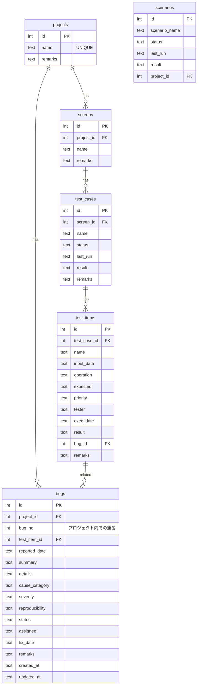

# データベース構造

## 概要

テスト自動化支援ツールは、SQLiteデータベースを使用してデータを管理しています。
データベースファイル: `data/scenarios.db`

## ER図

## テーブル構造詳細

### 1. projects（プロジェクト）
| カラム名 | 型 | 制約 | 説明 |
|----------|----|----|------|
| id | INTEGER | PRIMARY KEY, AUTOINCREMENT | プロジェクトID |
| name | TEXT | NOT NULL, UNIQUE | プロジェクト名 |
| remarks | TEXT | - | 備考 |

### 2. screens（画面）
| カラム名 | 型 | 制約 | 説明 |
|----------|----|----|------|
| id | INTEGER | PRIMARY KEY, AUTOINCREMENT | 画面ID |
| project_id | INTEGER | NOT NULL, FOREIGN KEY | プロジェクトID |
| name | TEXT | NOT NULL | 画面名 |
| remarks | TEXT | - | 備考 |

### 3. test_cases（テストケース）
| カラム名 | 型 | 制約 | 説明 |
|----------|----|----|------|
| id | INTEGER | PRIMARY KEY, AUTOINCREMENT | テストケースID |
| screen_id | INTEGER | NOT NULL, FOREIGN KEY | 画面ID |
| name | TEXT | NOT NULL | テストケース名 |
| status | TEXT | DEFAULT '未実行' | ステータス |
| last_run | TEXT | - | 最終実行日 |
| result | TEXT | - | 実行結果 |
| remarks | TEXT | - | 備考 |

### 4. test_items（テスト項目）
| カラム名 | 型 | 制約 | 説明 |
|----------|----|----|------|
| id | INTEGER | PRIMARY KEY, AUTOINCREMENT | テスト項目ID |
| test_case_id | INTEGER | NOT NULL, FOREIGN KEY | テストケースID |
| name | TEXT | NOT NULL | テスト項目名 |
| input_data | TEXT | - | 入力データ |
| operation | TEXT | - | 操作手順 |
| expected | TEXT | - | 期待結果 |
| priority | TEXT | - | 優先度 |
| tester | TEXT | - | 担当者 |
| exec_date | TEXT | - | 実施日 |
| result | TEXT | - | 結果 |
| bug_id | INTEGER | FOREIGN KEY | 不具合ID |
| remarks | TEXT | - | 備考 |

### 5. bugs（不具合）
| カラム名 | 型 | 制約 | 説明 |
|----------|----|----|------|
| id | INTEGER | PRIMARY KEY, AUTOINCREMENT | 不具合ID（内部用） |
| project_id | INTEGER | NOT NULL, FOREIGN KEY | プロジェクトID |
| bug_no | INTEGER | NOT NULL | プロジェクト内での不具合番号 |
| test_item_id | INTEGER | FOREIGN KEY | 関連テスト項目ID |
| reported_date | TEXT | - | 報告日 |
| summary | TEXT | - | 概要 |
| details | TEXT | - | 詳細 |
| cause_category | TEXT | - | 原因分類 |
| severity | TEXT | - | 重要度 |
| reproducibility | TEXT | - | 再現性 |
| status | TEXT | - | ステータス |
| assignee | TEXT | - | 担当者 |
| fix_date | TEXT | - | 修正日 |
| remarks | TEXT | - | 備考 |
| created_at | TEXT | - | 作成日時 |
| updated_at | TEXT | - | 更新日時 |

**制約**: UNIQUE(project_id, bug_no) - プロジェクトごとに不具合番号がユニーク

### 6. scenarios（シナリオ）
| カラム名 | 型 | 制約 | 説明 |
|----------|----|----|------|
| id | INTEGER | PRIMARY KEY, AUTOINCREMENT | シナリオID |
| scenario_name | TEXT | NOT NULL | シナリオ名 |
| status | TEXT | - | ステータス |
| last_run | TEXT | - | 最終実行日 |
| result | TEXT | - | 実行結果 |
| project_id | INTEGER | FOREIGN KEY | プロジェクトID |

## マスタテーブル群

以下のマスタテーブルでシステム全体で使用する選択肢を管理しています：

### 7. master_testers（テスト担当者）
- id: INTEGER PRIMARY KEY AUTOINCREMENT
- name: TEXT UNIQUE

### 8. master_test_types（テスト種別）
- id: INTEGER PRIMARY KEY AUTOINCREMENT
- name: TEXT UNIQUE

### 9. master_statuses（ステータス）
- id: INTEGER PRIMARY KEY AUTOINCREMENT
- name: TEXT UNIQUE

### 10. master_severities（重要度）
- id: INTEGER PRIMARY KEY AUTOINCREMENT
- name: TEXT UNIQUE

### 11. master_execution_statuses（実行ステータス）
- id: INTEGER PRIMARY KEY AUTOINCREMENT
- name: TEXT UNIQUE

### 12. master_priorities（優先度）
- id: INTEGER PRIMARY KEY AUTOINCREMENT
- name: TEXT UNIQUE

### 13. master_results（結果）
- id: INTEGER PRIMARY KEY AUTOINCREMENT
- name: TEXT UNIQUE

### 14. master_test_environments（テスト環境）
- id: INTEGER PRIMARY KEY AUTOINCREMENT
- name: TEXT UNIQUE

### 15. master_cause_categories（原因分類）
- id: INTEGER PRIMARY KEY AUTOINCREMENT
- name: TEXT UNIQUE

### 16. master_reproducibilities（再現性）
- id: INTEGER PRIMARY KEY AUTOINCREMENT
- name: TEXT UNIQUE

## 初期マスタデータ

システム初期化時に以下のマスタデータが自動投入されます：

### テスト担当者
- 宗廣, 井上, 遠藤, 田中

### テスト種別
- 単体テスト, 結合テスト, システムテスト, 受入テスト, 回帰テスト

### ステータス
- 未対応, 対応中, 修正済み, 保留, 却下, 再現不可, クローズ

### 重要度
- 致命的, 高, 中, 低

### 実行ステータス
- 未実施, 実施中, 実施済, 保留, 完了

### 優先度
- 高, 中, 低

### 結果
- 未実施, 成功, 失敗, 要確認, 再実施中

### テスト環境
- ローカル, 開発環境, ステージング, 本番環境

### 原因分類
- 仕様漏れ, 要件誤解, 実装ミス, 環境依存, 外部要因, テスト不備, その他

### 再現性
- 毎回発生, 条件付きで発生, まれに発生, 再現不可

## BUG-ID採番システム

不具合管理では以下の採番システムを採用：

1. **内部管理**: bugs.idで一意識別
2. **プロジェクト内連番**: bugs.bug_noでプロジェクト内の連番（1から開始）
3. **表示用ID**: "BUG-{bug_no:04d}" 形式で表示（例: BUG-0001, BUG-0012）

### 採番例
- プロジェクトA: BUG-0001, BUG-0002, BUG-0003, ...
- プロジェクトB: BUG-0001, BUG-0002, BUG-0003, ...

## データの関連性

1. **階層構造**: プロジェクト → 画面 → テストケース → テスト項目
2. **不具合との関連**: 
   - 不具合はプロジェクトに属する
   - 不具合は特定のテスト項目に関連付け可能
3. **マスタデータ**: 各種選択肢はマスタテーブルで一元管理

## データベース初期化

`core/scenario_db.py`の`init_db()`関数により：
1. 必要なテーブルの作成
2. 初期マスタデータの投入
3. 既存テーブルのマイグレーション

が自動実行されます。

## 主要な関数

- `init_db()`: データベース初期化
- `get_next_bug_no(project_id)`: 次のBUG番号取得
- `get_master_data(table_name)`: マスタデータ取得
- `get_all_scenarios()`: シナリオ一覧取得
- `insert_bug(data)`: 不具合登録
- `delete_project(project_id)`: プロジェクト削除（関連データも含む）

## 注意事項

1. **外部キー制約**: SQLiteの外部キー制約は有効になっているため、参照整合性が保たれます
2. **マイグレーション**: 既存のデータベースファイルがある場合、自動的にマイグレーションが実行されます
3. **日時データ**: 日時は文字列（TEXT）型で格納されます
4. **プロジェクト削除**: プロジェクト削除時は関連する全データ（画面、テストケース、テスト項目）が自動削除されます